## 프로젝트 개요

### 참여인원

4명 (**팀장:** 조정혜 외 3인)

### 개발 환경

- **백엔드:** Spring Framework 5.x
- **프런트엔드:** React 16.x
- **데이터베이스:** Oracle 11g Express

### 내 업무범위

- 기획 25%, DB 설계 25%
- 메인 페이지 및 유저 페이지 전반의 프런트엔드·백엔드를 개발

### 설명

사용자 위치를 기반으로 맛집을 검색하고 원격 줄서기가 가능한 웹 애플리케이션입니다. 리뷰 작성이 가능하며 이를 기반으로 가벼운 SNS 기능을 제공합니다.

사장님 계정을 위한 사장님 페이지를 제공합니다. 관리자 계정을 위한 관리자 페이지를 제공합니다.

## DB 설계

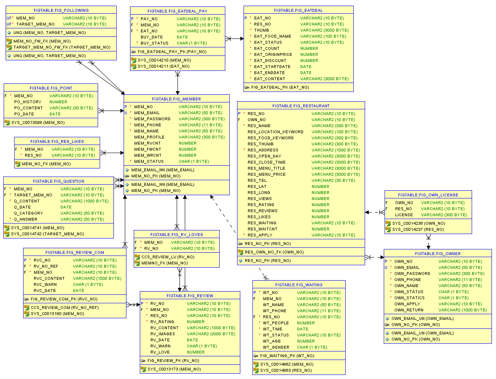

## 주요 기능

**제가 개발한 메인 페이지 및 유저 페이지의 기능 위주로 서술한 내용입니다. 😊**

쿠폰 페이지, 사장님 페이지 그리고 관리자 페이지 등 실제 웹 애플리케이션에서 더 많은 기능을 확인하실 수 있습니다!

### 기본기능

현재 위치를 기반으로 맛집 검색, 원격 줄서기가 가능합니다.

맛집 검색의 경우 검색 결과가 가까운 거리 순으로 정렬됩니다. 원격 줄서기의 경우 맛집 위치가 현재 위치와 3km 이내일 때 줄을 설 수 있습니다.

1. 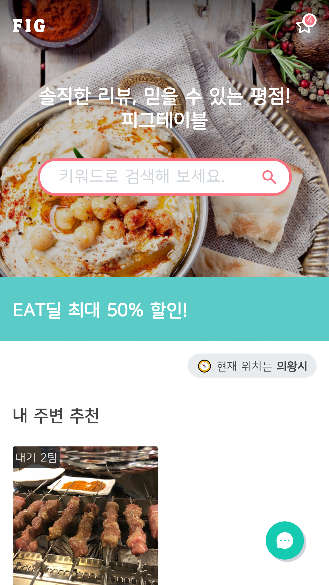
2. 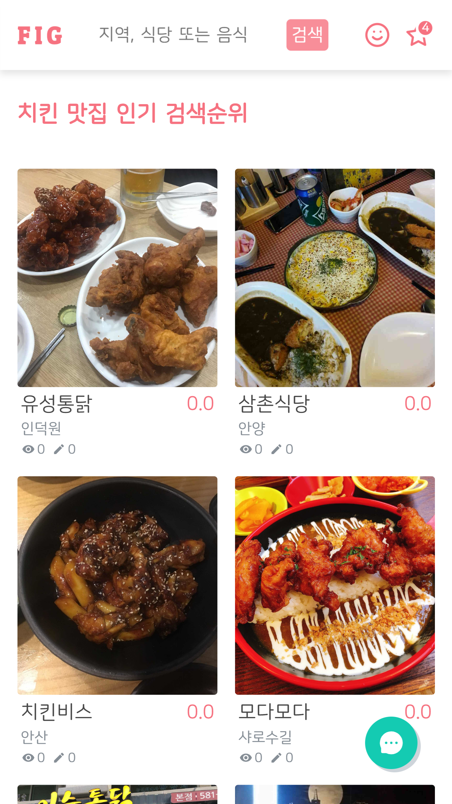
3. 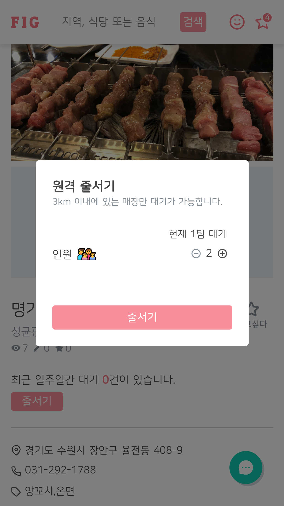
4. 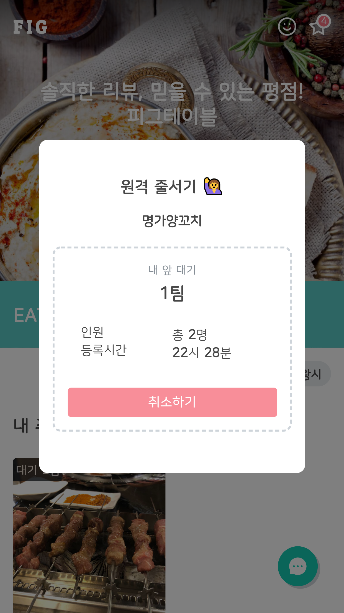

맛집에 리뷰를 작성할 수 있습니다. 리뷰 작성 시 포인트가 지급되며 리뷰를 삭제할 때는 포인트가 차감됩니다.

1. 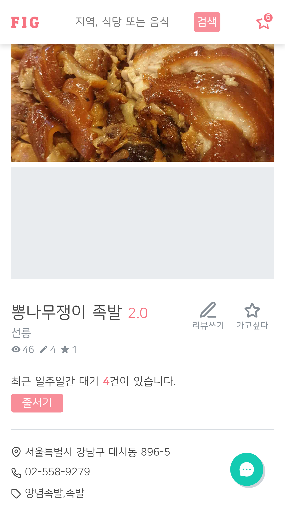
2. 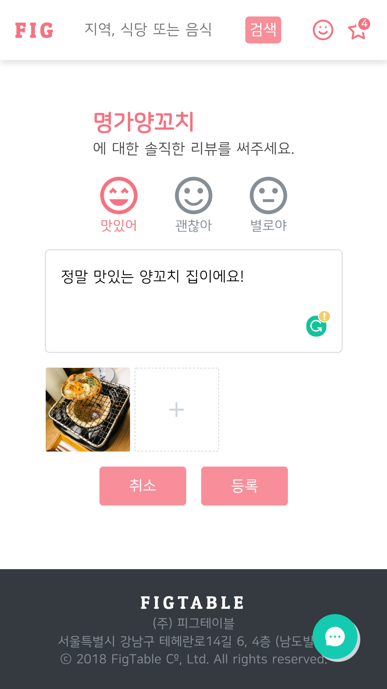
3. 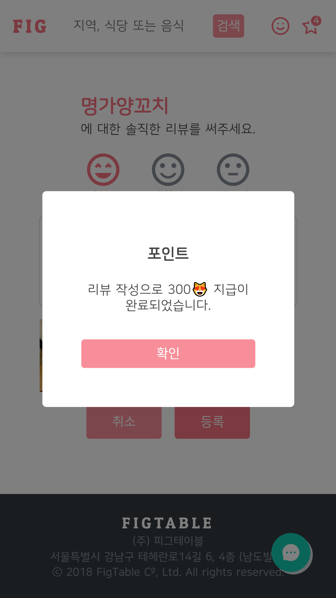
4. 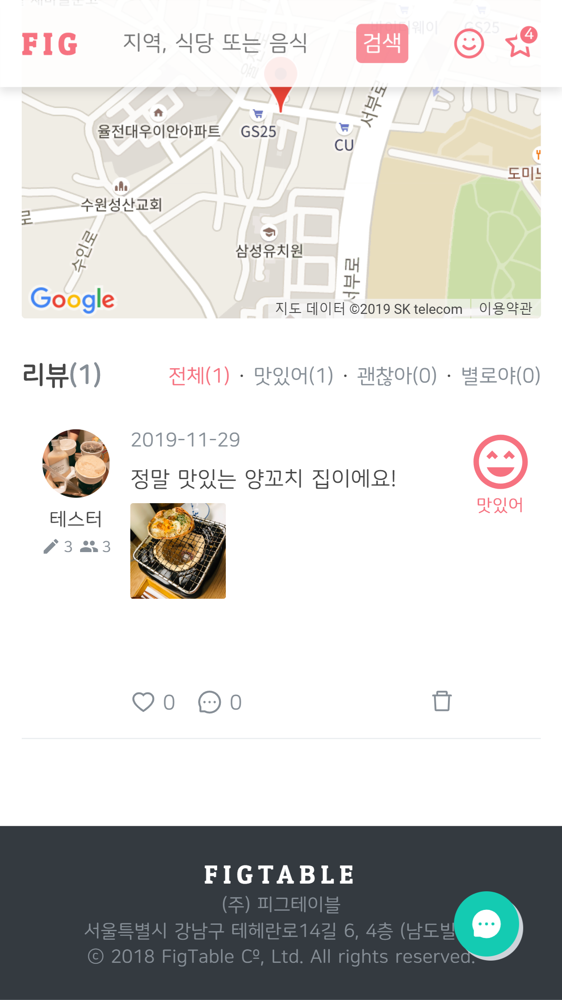

### 소셜기능

리뷰에 공감할 수 있으며 댓글을 달 수 있습니다. 만약 적절하지 못한 리뷰가 있을 경우 리뷰를 신고할 수도 있습니다.
유저끼리 팔로잉할 수 있으며 팔로잉한 유저의 리뷰를 모아 피드를 제공합니다.

1. 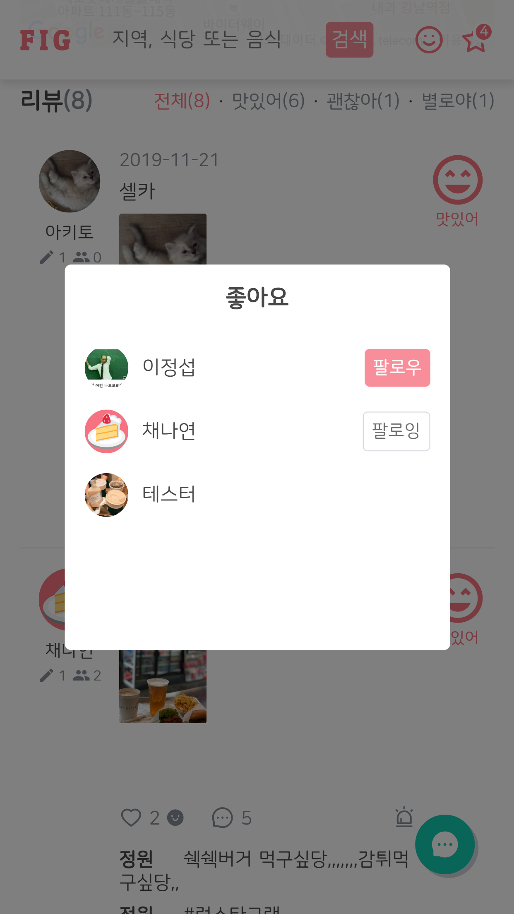
2. 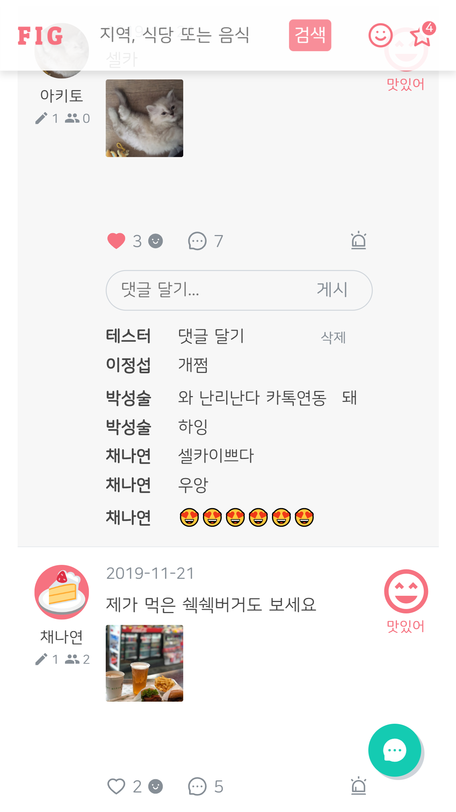
3. 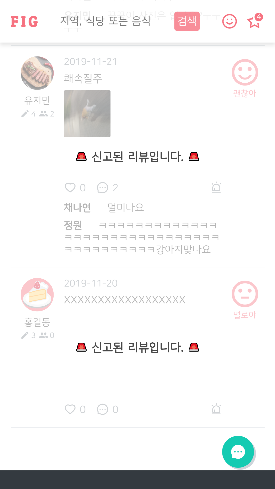
4. 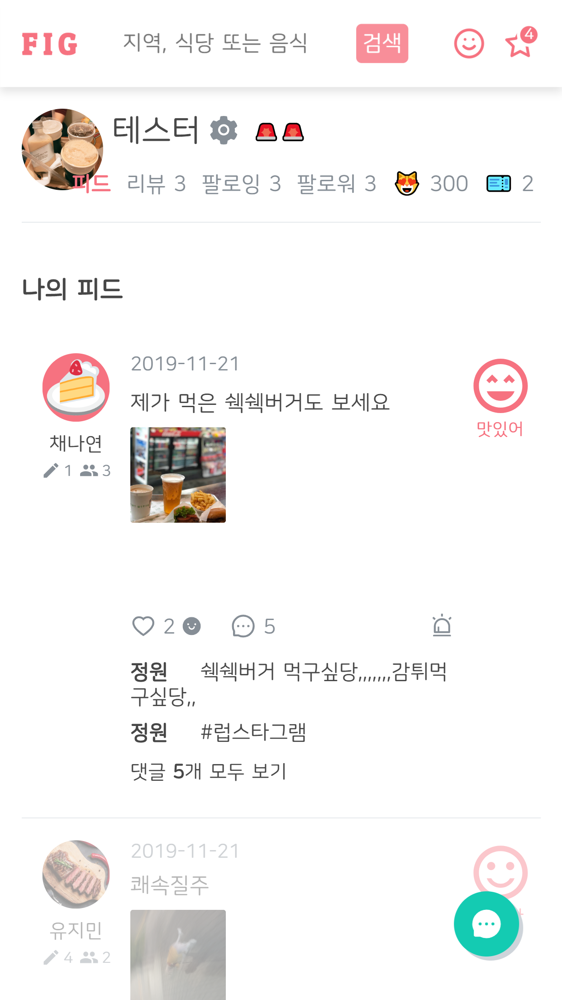

### 기타기능

내가 쓴 리뷰를 모아 확인할 수 있습니다. 만약 내가 남긴 리뷰가 신고되었다면 경고가 쌓이게 되는데 이때는 포인트를 이용해 경고를 풀 수 있습니다. 포인트 적립 및 사용을 조회할 수 있습니다. 또한 로그인 시 문의하기를 통해 여러 내용을 문의할 수 있습니다.

1. 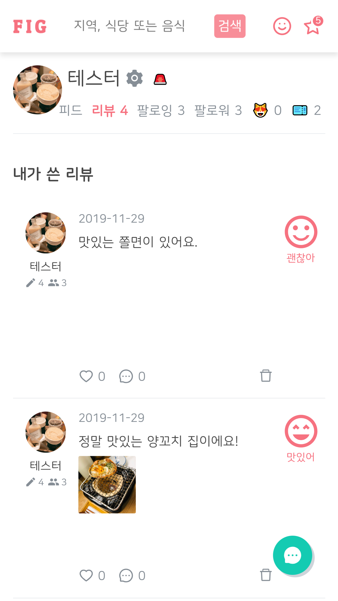
2. 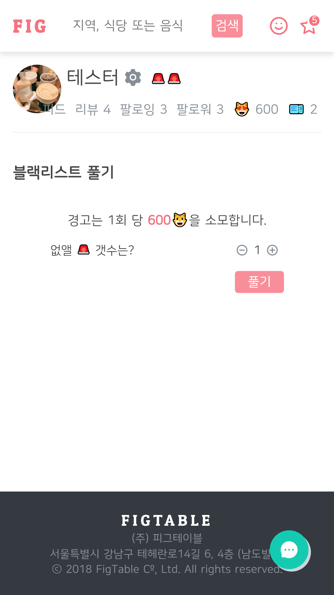
3. 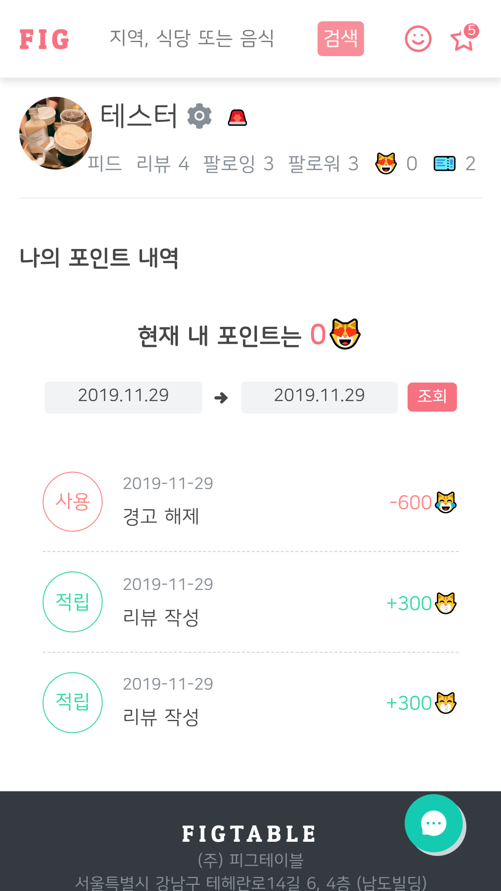
4. 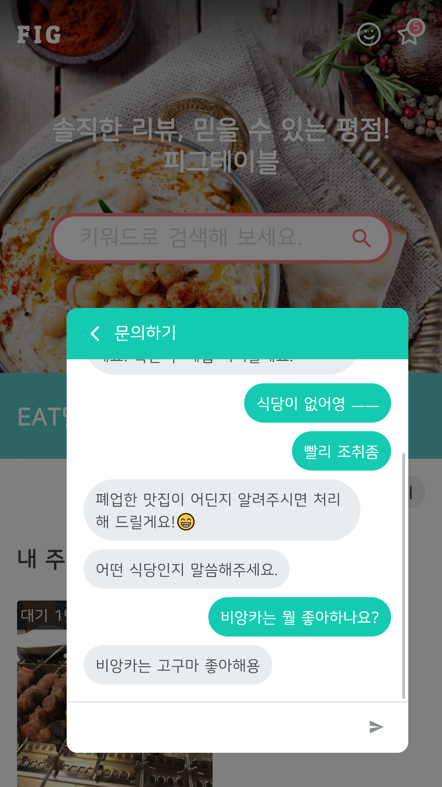
