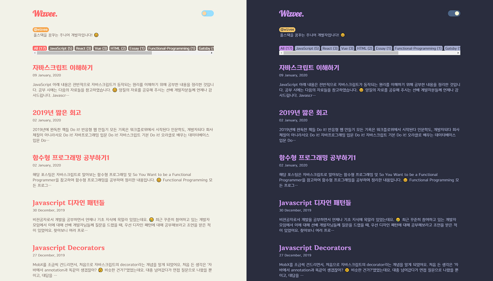
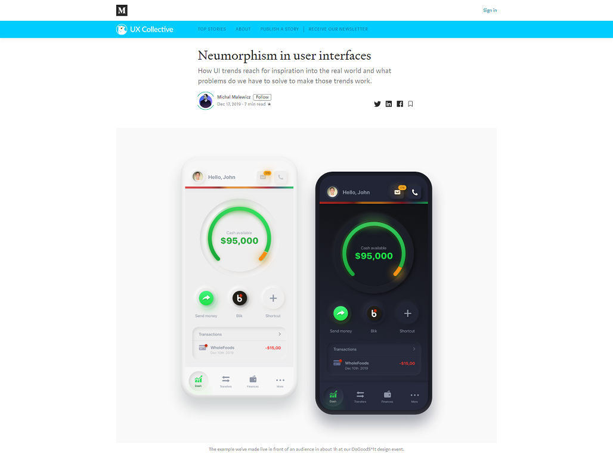

최근 업무에 바빠 블로그에 신경을 쓰지 못했어요. 😂 분명 초반에는 양질의 포스팅을 하기 위해 노력했었는데, 어느 순간 메모와 다를 바 없는 TIL만 적고 있더라고요. 이래서는 안 되겠다 싶어, 블로그를 리뉴얼하기로 결심했습니다. 디자인은 물론, 포스트까지 싹 다 정리하기로요!

## 디자인

블로그 초기 디자인은 VS Code의 material theme를 주제로 했었어요. Material theme는 제가 제일 좋아하는 VS Code 테마로 현재도 사용 중이긴 하지만, 그렇기 때문에 블로그에서까지 똑같은 디자인을 보기에는 좀 질리더라고요.

그래서 뭐 좋은 게 없을까 구글링하다가, 2020년 웹 디자인 트렌드라는 **뉴모피즘(neumorphism)**을 발견하게 되었어요.

[https://uxdesign.cc](https://uxdesign.cc/neumorphism-in-user-interfaces-b47cef3bf3a6)

이거다! 싶어 블로그에 적용해보기로 했습니다. 😎
